# Entity-Relationship Diagram — Manufacturing & Industrial Analytics FYP
## Database Schema — Phase 1 (All 7 Tables)
**Generated:** Day 3 — July 18, 2026 | **Revised:** Day 8 — July 20, 2026 (added `failure_log`)
**Scope:** SQL DDL defined in `sql/schema.sql`  
**DB Target:** SQLite 3.x (dev) / SQL Server 2019+ (prod)

---

## Mermaid ERD

```mermaid
erDiagram

    %% =========================================================
    %% ENTITY: components
    %% Master lookup — 5 physical pipeline nodes
    %% =========================================================
    components {
        INTEGER component_id          PK   "NOT NULL"
        VARCHAR component_name              "e.g. Bearing, Gearbox"
        INTEGER position_in_chain           "1 (upstream) to 5 (downstream)"
        VARCHAR failure_mode                "primary failure mode description"
        FLOAT   weibull_beta_min            "Weibull shape lower bound"
        FLOAT   weibull_beta_max            "Weibull shape upper bound"
        FLOAT   weibull_eta_hours           "characteristic life in hours"
        FLOAT   activation_energy_ev        "Arrhenius Ea in eV; NULL for Shaft"
        VARCHAR maintenance_strategy        "PM | CBM | PM_CBM"
    }

    %% =========================================================
    %% ENTITY: sensors
    %% One row per physical sensor per component
    %% =========================================================
    sensors {
        INTEGER sensor_id              PK   "NOT NULL"
        INTEGER component_id           FK   "→ components.component_id"
        VARCHAR sensor_type                  "vibration | temperature | rpm | load | pressure | oil_debris"
        VARCHAR unit_of_measure              "mm/s_rms | degC | rpm | pct | bar | count"
        FLOAT   iso_alarm_threshold          "Zone C onset (mm/s or equiv)"
        FLOAT   iso_danger_threshold         "Zone D onset (mm/s or equiv)"
        FLOAT   sample_rate_hz               "data acquisition frequency"
        INTEGER is_active                    "1=active, 0=decommissioned"
    }

    %% =========================================================
    %% ENTITY: sensor_readings
    %% Time-series fact table — one row per sensor event
    %% =========================================================
    sensor_readings {
        INTEGER  reading_id            PK   "NOT NULL"
        INTEGER  sensor_id             FK   "→ sensors.sensor_id"
        INTEGER  component_id          FK   "→ components.component_id (denorm)"
        DATETIME ts                         "UTC timestamp"
        FLOAT    value                      "raw sensor measurement"
        INTEGER  is_failure_event           "1 if failure event at this timestep"
        VARCHAR  failure_mode               "e.g. rolling_element_fatigue; NULL if normal"
        FLOAT    r_derated                  "Weibull R*(t) with Arrhenius eta*; [0,1]"
        FLOAT    arrhenius_factor           "AF = exp[(Ea/k)*(1/T_use-1/T_stress)]"
        INTEGER  cascade_flag               "1 if vibration elevated by upstream failure"
        INTEGER  cycle_number               "1-indexed failure cycle (resets post-repair)"
        FLOAT    health_score               "r_derated*100; Power BI Fleet KPI"
        INTEGER  is_anomaly                 "1 if value >= iso_alarm_threshold"
        VARCHAR  iso_zone                   "A | B | C | D (vibration only)"
    }

    %% =========================================================
    %% ENTITY: failure_log  [NEW Day 8]
    %% One row per discrete failure event (one per component per cycle)
    %% Primary input for Phase 2 Weibull MLE fitting
    %% =========================================================
    failure_log {
        INTEGER failure_id             PK   "NOT NULL"
        INTEGER component_id           FK   "→ components.component_id"
        INTEGER cycle_number                "1-indexed failure cycle number"
        FLOAT   ttf_hours                   "time-to-failure hours (Weibull draw)"
        FLOAT   t_failure_abs               "absolute sim time hours from anchor; NULL=censored"
        FLOAT   beta_mid                    "Weibull beta at draw time (temporal snapshot)"
        FLOAT   eta_nominal_h               "nominal eta before Arrhenius derating"
        FLOAT   eta_effective_h             "derated eta = eta_nominal / AF; NULL for Shaft"
        FLOAT   ea_ev                       "Ea (eV) at draw time; NULL for Shaft"
        VARCHAR strategy                    "PM | CBM | PM_CBM at draw time"
        FLOAT   repair_hours                "stochastic MTTR; NULL if censored"
        VARCHAR failure_mode                "e.g. rolling_element_fatigue"
        FLOAT   qq_r_squared                "R^2 from Weibull Q-Q linearisation"
    }

    %% =========================================================
    %% ENTITY: production_shifts
    %% One row per planned production window per component per day
    %% OEE denominator: planned_duration_min
    %% =========================================================
    production_shifts {
        INTEGER  shift_id              PK   "NOT NULL"
        INTEGER  component_id          FK   "→ components.component_id"
        DATE     shift_date                 "calendar date"
        VARCHAR  shift_label               "DAY | NIGHT | SWING"
        DATETIME planned_start_ts           "UTC scheduled start"
        DATETIME planned_end_ts             "UTC scheduled end"
        FLOAT    planned_duration_min       "total planned window (min)"
    }

    %% =========================================================
    %% ENTITY: downtime_events
    %% One row per downtime occurrence — OEE Availability input
    %% Taxonomy: unplanned_failure | planned_maintenance |
    %%           changeover | idle | cascade_upstream
    %% =========================================================
    downtime_events {
        INTEGER  downtime_id           PK   "NOT NULL"
        INTEGER  component_id          FK   "→ components.component_id"
        INTEGER  shift_id              FK   "→ production_shifts.shift_id"
        DATETIME start_ts                   "UTC downtime start"
        DATETIME end_ts                     "UTC downtime end"
        FLOAT    duration_min               "length of downtime (min)"
        VARCHAR  downtime_category          "unplanned_failure | planned_maintenance | changeover | idle | cascade_upstream"
        VARCHAR  downtime_type              "equipment | process | quality"
        VARCHAR  failure_mode               "e.g. bearing_seizure, overtemp_shutdown"
        VARCHAR  component_name             "denormalized for convenience"
        INTEGER  root_cause_component_id   "FK → components (cascade events only)"
    }

    %% =========================================================
    %% ENTITY: production_counts
    %% One row per shift per component — OEE Performance & Quality
    %% Constraint: good + defective + rework = total
    %% =========================================================
    production_counts {
        INTEGER count_id                    PK   "NOT NULL"
        INTEGER component_id               FK   "→ components.component_id"
        INTEGER shift_id                   FK   "→ production_shifts.shift_id"
        INTEGER total_units                     "good + defective + rework"
        INTEGER good_units                      "first-pass yield count"
        INTEGER defective_units                 "scrapped / rejected"
        INTEGER rework_units                    "rework (quality loss)"
        FLOAT   ideal_cycle_time_min            "nameplate time per unit (min)"
        INTEGER defect_source_component_id  FK  "→ components (cascade defects)"
    }

    %% =========================================================
    %% RELATIONSHIPS
    %% =========================================================

    %% components → sensors (one-to-many)
    %% One component can have multiple sensor types installed
    components  ||--o{ sensors              : "has sensors"

    %% sensors → sensor_readings (one-to-many)
    %% Each sensor produces many time-series readings
    sensors     ||--o{ sensor_readings      : "generates readings"

    %% components → sensor_readings (one-to-many; denormalized FK)
    %% Direct component FK on readings table avoids double-join in KPI queries
    components  ||--o{ sensor_readings      : "component readings"

    %% components → failure_log (one-to-many) [NEW Day 8]
    %% One component can have multiple failure events across cycles
    components  ||--o{ failure_log          : "component failures"

    %% components → production_shifts (one-to-many)
    %% Each component has one or more planned production shifts
    components  ||--o{ production_shifts    : "has shifts"

    %% production_shifts → downtime_events (one-to-many)
    %% A shift can have zero or many downtime events
    production_shifts ||--o{ downtime_events  : "contains downtime"

    %% components → downtime_events (one-to-many)
    %% Direct component FK for filtering without joining shifts
    components  ||--o{ downtime_events      : "component downtime"

    %% components → downtime_events.root_cause (one-to-many, optional)
    %% Cascade failure attribution: upstream component FK
    components  ||--o{ downtime_events      : "root cause of cascade"

    %% production_shifts → production_counts (one-to-one per component)
    %% Each shift has exactly one production count row per component
    production_shifts ||--o{ production_counts : "shift counts"

    %% components → production_counts (one-to-many)
    components  ||--o{ production_counts    : "component counts"

    %% components → production_counts.defect_source (one-to-many, optional)
    %% Quality root-cause attribution: upstream component FK
    components  ||--o{ production_counts    : "defect source attribution"
```



---

## Relationship Matrix

| Parent Table | Child Table | Cardinality | FK Column | Purpose |
|---|---|---|---|---|
| `components` | `sensors` | 1 : N | `sensors.component_id` | A component has multiple sensor types |
| `sensors` | `sensor_readings` | 1 : N | `sensor_readings.sensor_id` | Each sensor logs many readings |
| `components` | `sensor_readings` | 1 : N | `sensor_readings.component_id` | Denorm FK — avoids double join in KPI queries |
| `components` | `failure_log` | 1 : N | `failure_log.component_id` | **[NEW Day 8]** One row per failure event per cycle |
| `components` | `production_shifts` | 1 : N | `production_shifts.component_id` | Each component can have multiple shifts per day |
| `production_shifts` | `downtime_events` | 1 : N | `downtime_events.shift_id` | Multiple downtime events within a single shift |
| `components` | `downtime_events` | 1 : N | `downtime_events.component_id` | Direct component filter without joining shifts |
| `components` | `downtime_events` | 1 : N | `downtime_events.root_cause_component_id` | Cascade failure attribution to upstream component |
| `production_shifts` | `production_counts` | 1 : 1 per comp | `production_counts.shift_id` | Exactly one count row per component per shift |
| `components` | `production_counts` | 1 : N | `production_counts.component_id` | Component-level quality drill-down |
| `components` | `production_counts` | 1 : N | `production_counts.defect_source_component_id` | Upstream defect attribution for quality root-cause |

---

## Key Design Decisions

### 1. Denormalized `component_id` in `sensor_readings`
`sensor_readings` carries both `sensor_id` (precise FK) and `component_id` (denormalized). This trades minimal storage overhead for significant query simplification: KPI queries that aggregate readings by component skip the `sensors → sensor_readings` join entirely.

### 2. Self-Referential FKs in `downtime_events` and `production_counts`
`downtime_events.root_cause_component_id` and `production_counts.defect_source_component_id` both reference the `components` table. These optional FKs implement the cascade failure attribution pattern established in Day 2:

- **Availability cascade:** When Bearing (position 1) fails, all downstream components get a `downtime_events` row with `downtime_category = 'cascade_upstream'` and `root_cause_component_id = 1`.
- **Quality cascade:** Defects introduced upstream are recorded at the production count row of the final inspection point, with `defect_source_component_id` pointing to the originating component.

### 3. Stored vs. Computed Duration Columns
`planned_duration_min` (in `production_shifts`) and `duration_min` (in `downtime_events`) are stored redundantly. The invariant is enforced at application layer in `etl.py`. This pattern optimizes read performance (OEE aggregation queries sum `duration_min` without date arithmetic) at the cost of a write-time validation requirement.

### 4. Unique Constraint on `production_counts`
`UNIQUE (component_id, shift_id)` on `production_counts` enforces data integrity: exactly one count record per component per shift. Violations indicate duplicate simulation inserts and are caught at the SQL layer before reaching Python.

---

## Pipeline Topology Mapped to Schema

```
Series Chain:  Bearing(1) → Shaft(2) → Motor Housing(3) → Coupling(4) → Gearbox(5)
               ─────────────────────────────────────────────────────────────────────
Series Rule:   R_sys(t) = ∏ R_i(t)    [reliability.py: series_system_reliability()]
OEE A_sys:     min(A_1, ..., A_5)     [kpi.py: compute_system_oee()]
OEE P_sys:     min(P_1, ..., P_5)     [kpi.py: compute_system_oee()]
OEE Q_sys:     Q_1 × Q_2 × ... × Q_5 [kpi.py: compute_system_oee()]
```

---

*Document maintained by Antigravity AI. Append-only. Created Day 3.*
